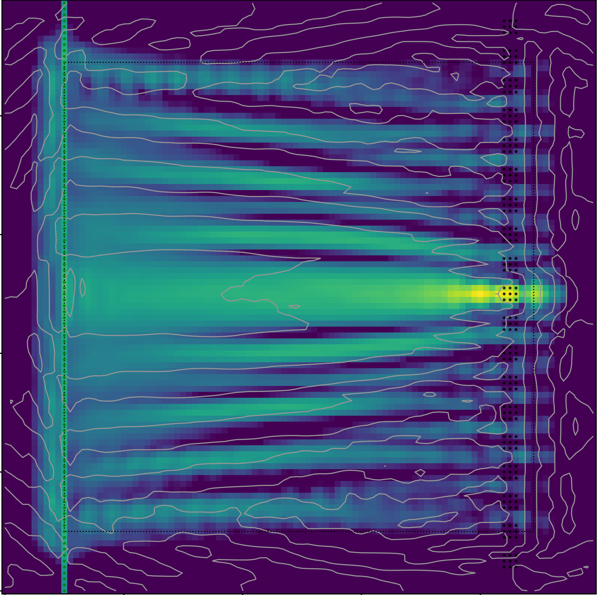

# SpinTorch
SpinTorch is a micromagnetic simulator with machine-learning capabilities. The code is based on PyTorch, which makes it able to realize gradient-based optimization and machine-learning tasks in the spin-wave domain. 

Check out our paper for more information about our results: 
Papp, Á., Porod, W. & Csaba, G. Nanoscale neural network using non-linear spin-wave interference. Nat Commun 12, 6422 (2021). https://doi.org/10.1038/s41467-021-26711-z

## Try it!
Just run the provided example script focus.py, and look for results in the plots folder. You can play around with the parameters in the script, and try the three different optimization geometries that are currently implemented. This example will run on a modern laptop with an entry level Nvidia GPU in just a few minutes.

## Requirements
The code is currently tested with PyTorch 1.10.1, Python 3.9.9, CUDA 11.3, and up-to-date versions of a few other standard packages, older versions might not work out-of-the-box.
It can run on both CPU and GPU (Nvidia), but GPU operation is preferred, CPU is much slower and not tested. GPU requirements are the same as required by PyTorch.
